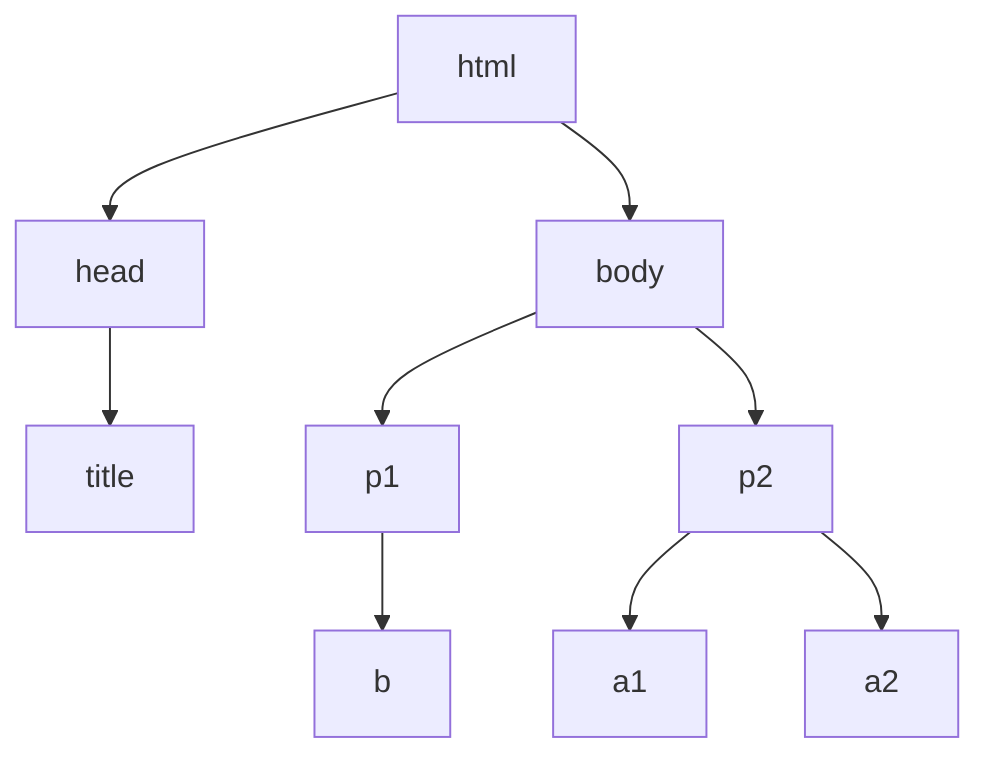

[TOC]


# 第二周内容导学

## 掌握定向网络数据爬取和网页解析的基本能力

+ 学习如何解析HTML页面的基本方法
+ 讲解Beautiful Soup库
  + 信息标记与提取方法
+ 实例


****

# Beautiful Soup库的安装

## 介绍

可以对HTML，XML格式进行解析，并且提取其中的相关信息

`https://www.crummy.com/software/BeautifulSoup/`

官网对它的描述：

+ Beautiful Soup parses anything you give it, and does the tree traversal stuff for you. 

+ Beautiful Soup可以对你提供给它的任何格式进行相关的爬取，并且进行树形解析

工作原理是把任何文档当作一锅汤，煲制这锅汤。

## 安装

管理员权限打开cmd

```cmd
>>> pip install beautifulsoup4
```

## 测试：获取网页源代码

演示HTML页面地址：

`http://python123.io/ws/demo.html`

### 手动获取源代码

右键：查看网页源代码

### 用Requests库查看源代码

```python
>>> import requests
>>> r = requests.get("http://python123.io/ws/demo.html")
>>> r.text      
>>> demo = r.text
```

测试Beautiful Soup库

首先导入Beautiful Soup库

```python
>>> from bs4 import BeautifulSoup
```

从bs4库导入BeautifulSoup类

做汤，把html页面熬成一个Beautiful Soup能够理解的汤

```python
>>> soup = BeautifulSoup(demo, "html.parser")
```

除了给出demo变量，还需要给出一个解析demo的解释器，这里用的解释器是html.parser，即对demo进行html的解析

打印结果测试解析是否正确

```python
>>> print(soup.prettify())
```

## 如何使用BeautifulSoup库

```python
from bs4 import BeautifulSoup
soup = BeautifulSoup('<p>data</p>', 'html.parser')
```

BeautifulSoup有两个参数，第一个是需要BeautifulSoup解析的一个html格式的信息，另一个是解析汤使用的解析器


****

# Beautiful Soup库的基本元素

## BeautifulSoup类

### HTML文件

```html
<html>
    <body>
        <p class = "title">
            ...
        </p>
    </body>
</html>
```

HTML文件的源代码是由一组尖括号构成的标签组织起来的，每一对尖括号形成了一个标签，标签之间存在上下级关系，形成了标签树。

Beautiful Soup库是解析、遍历、维护“标签树”的功能库。只要提供的文件是标签类型，Beautiful Soup库都可以对它做很好的解析。

看下每个标签的具体格式。

以p标签为例

```html
<p class = "title">
    ...
</p>
```

一对尖括号和一对尖括号中间有斜线形成了一个标签对，Tag。

其中第一个尖括号中的第一个单词p就是这个标签的名称，Name。一般标签的名称是成对出现的，在最开始和最后都出现标明这个标签的范围。

在第一对尖括号中，除了名字之外，存在了一个相关的域，这个域叫属性域，Attributes。这里面包含0个或多个属性，属性用来定义标签的特点。这里有一个属性叫class，属性的内容是title。任何一个属性有它属性的特性和它的值。所以属性是由键和值，键值对构成的。

这样的格式构成了标签的基本结构。


### Beautiful Soup库的引用

Beautiful Soup库也叫beautifulsoup4库或bs4。

我们在使用它的时候需要采用一些引用方式。

最常用的是

```python
from bs4 import BeautifulSoup
```

这个引用方式说明我们从bs4库中引入了一个类型，这个类型叫BeautifulSoup。

BeautifulSoup中的B和S要大写，因为Python是一个大小写敏感的语言。

如果我们要对Beautiful Soup库中的一些基本变量进行判断的时候，我们也可以直接引用

```python
import bs4
```


### 如何理解BeautifulSoup这个类

Beautiful Soup库本身解析的是HTML和XML文档，文档和标签树是一一对应的，经过了BeautifulSoup类的处理，我们可以使得每一个标签树（字符串），我们将这个标签树转换成一个BeautifulSoup类 ，BeautifulSoup类就是能代替标签树的一个类型。

所以HTML文档，标签树，BeautifulSoup类三者是等价的。

在这个基础上，我们可以通过BeautifulSoup类使得标签树形成了一个变量，而对这个变量的处理就是对标签树的处理。

这里可以使用如下代码：

```python
>>> from bs4 import BeautifulSoup
>>> soup = BeautifulSoup("<html>data</html>", "html.parser")
>>> soup2 = BeautifulSoup(open("D://demo.html"), "html.parser")
```

首先import BeautifulSoup类型。

定义一个变量soup，给入一个HTML代码，指定HTML格式的parser来解析。

同时也可以通过打开文件的方式，为BeautifulSoup类提供XML或HTML的文档内容。

简单来说，可以把BeautifulSoup类对应一个HTML/XML文档的全部内容。


### 解析器

| 解析器           | 使用方法                         | 条件                 |
| ---------------- | -------------------------------- | -------------------- |
| bs4的HTML解析器  | BeautifulSoup(mk, 'html.parser') | 安装bs4库            |
| lxml的HTML解析器 | BeautifulSoup(mk, 'lxml')        | pip install lxml     |
| lxml的XML解析器  | BeautifulSoup(mk, 'xml')         | pip install lxml     |
| html5lib的解析器 | BeautifulSoup(mk, 'html5lib')    | pip install html5lib |

事实上无论哪种解析器，都可以有效解析HTML和XML文档。

****

## BeautifulSoup类的基本元素

| 基本元素        | 说明                                                      |
| --------------- | --------------------------------------------------------- |
| Tag             | 标签，最基本的信息组织单元，分别用<>和</>表明开头和结尾   |
| Name            | 标签的名字，<p>...</p>的名字是'p'，格式：<tag>.name来获取 |
| Attributes      | 标签的属性，字典形式组织，格式：<tag>.attrs               |
| NavigableString | 标签内非属性字符串，<>...</>中字符串，格式：<tag>.string  |
| Comment         | 标签内字符串的注释部分，一种特殊的Comment类型             |


### 分析demo.html 

1. #### 获取标签Tag的方法

```python
>>> import requests
>>> from bs4 import BeautifulSoup
>>> r = requests.get("http://python123.io/ws/demo.html")
>>> r.text      
>>> demo = r.text
>>> soup = BeautifulSoup(demo, "html.parser")
>>> soup.title
<title>This is a python demo page</title>                     
>>> tag = soup.a
>>> tag
<a class="py1" href="http://www.icourse163.org/course/BIT-268001" id="link1">Basic Python</a>
```

title标签就是在浏览器左上方显示信息的地方的内容

a标签是链接标签

用soup.a获得a标签

Tag标签是什么类型：

```python
>>> type(tag)
<class 'bs4.element.Tag'>
```

tag是`<class 'bs4.element.Tag'>`类型


2. #### 获取标签名字Name的方法

```python
>>> from bs4 import BeautifulSoup
>>> soup = BeautifulSoup(demo, "html.parser")
>>> soup.a.name
'a'
>>> soup.a.parent.name
'p'
>>> soup.a.parent.parent.name
'body'
```

a标签的名字，a标签父亲的名字（包含a标签的上一层标签）


3. #### 获取tag标签的属性Attributes

```python
>>> tag = soup.a
>>> tag.attrs
{'href': 'http://www.icourse163.org/course/BIT-268001', 'class': ['py1'], 'id': 'link1'}
```

返回的是一个字典，给出了，属性名字和属性的值的对应关系。

我们可以采用字典的方式对每一个属性做信息的提取。

获取class属性的值：

```python
>>> tag.attrs['class']
['py1']
```

返回一个列表类型，第一个元素是['py1']。

获得a标签的链接属性的值：

```python
>>> tag.attrs['href']
'http://www.icourse163.org/course/BIT-268001'
```

标签属性Attributes的类型：

```python
>>> type(tag.attrs)
<class 'dict'>
```

标签属性是字典类型


4. #### NavigableString 类型

尖括号中间的内容

```python
>>> soup.a
>>> soup.a.string
'Basic Python'
>>> soup.p
<p class="title"><b>The demo python introduces several python courses.</b></p>
>>> soup.p.string
'The demo python introduces several python courses.'
>>> type(soup.p.string)
<class 'bs4.element.NavigableString'>
```

NavigableString是一个bs4库定义的NavigableString类型

注意，在查看p标签的时候：

```python
>>> soup.p
<p class="title"><b>The demo python introduces several python courses.</b></p>
```

还输出了一个b标签。但是当打印`soup.p.string`的时候，并不包含b标签

这说明：NavigableString是可以跨越多个标签层次的。


5. #### Comment 类型

注释，表示如果HTML页面中有注释的部分，该如何处理

实例：

```python
>>> newsoup = BeautifulSoup("<b><!--This is a comment--></b><p>This is not a comment</p>", "html.parser")
```

在这个例子中，有一个b标签，里面有一个注释。使用`<!` 表示一个注释的开始。p标签中的信息并不是一个注释。

看下b标签的string：

```python
>>> newsoup.b.string
'This is a comment'
>>> type(newsoup.b.string)
<class 'bs4.element.Comment'>
```

b标签打印出了注释内容，类型是`<class 'bs4.element.Comment'>`，是comment类型。

看下p标签：

```python
>>> newsoup.p.string
'This is not a comment'
>>> type(newsoup.p.string)
<class 'bs4.element.NavigableString'>
```

p标签不是comment类型，是字符串，类型是NavigableString类型 

这里需要注意的是：

**使用b.string和p.string都产生了一段字符串，不过两个字符串没有区别，无法判断哪个是标签，注释的<!标识被去掉了。在分析文档的时候，需要对其中的注释部分做相关的判断，判断的依据就是它的类型。不过这种情况在实际分析文本中并不常用。**


****

#  基于bs4库的HTML内容遍历方法

回顾demo.html:

```python
>>> import requests
>>> r = requests.get("http://python123.io/ws/demo.html")
>>> r.text      
>>> demo = r.text
>>> demo
'<html><head><title>This is a python demo page</title></head>\r\n<body>\r\n<p class="title"><b>The demo python introduces several python courses.</b></p>\r\n<p class="course">Python is a wonderful general-purpose programming language. You can learn Python from novice to professional by tracking the following courses:\r\n<a href="http://www.icourse163.org/course/BIT-268001" class="py1" id="link1">Basic Python</a> and <a href="http://www.icourse163.org/course/BIT-1001870001" class="py2" id="link2">Advanced Python</a>.</p>\r\n</body></html>'
```

做结构化设计：

```html
<html>
    <head>
        <title>This is a python demo page</title>
    </head>
	<body>
		<p class="title">
    		<b>The demo python introduces several python courses.</b>
    	</p>
    	<p class="course">Python is a wonderful general-purpose programming language. You can learn Python from novice to professional by tracking the following courses:
			<a class="py1" href="http://www.icourse163.org/course/BIT-268001" id="link1">Basic Python</a> and 
    		<a class="py2" href="http://www.icourse163.org/course/BIT-1001870001" id="link2">Advanced Python</a>.
    	</p>
	</body>
</html>
```

标签标明了信息的逻辑关系。

用树状图表示：



三种遍历方法：

+ 下行遍历（从根节点向叶子节点）

+ 上行遍历（从叶子节点向根节点）

+ 平行遍历（在平级节点直接遍历）

****


## 下行遍历方法：

| 属性         | 说明                                                    |
| ------------ | ------------------------------------------------------- |
| .contents    | 子节点的列表，将tag所有儿子节点存入列表                 |
| .children    | 子节点的迭代类型，与.contents类似，用于循环遍历儿子节点 |
| .descendants | 子孙节点的迭代类型，包含所有子孙节点，用于循环遍历      |

### 例子：

```python
>>> soup = BeautifulSoup(demo, "html.parser")
>>> soup.head
<head><title>This is a python demo page</title></head>
>>> soup.head.contents
[<title>This is a python demo page</title>]
```

head标签的儿子节点是title标签，title标签被放到了一个列表中。

body标签的儿子节点：

```python
>>> soup.body.contents
['\n', <p class="title"><b>The demo python introduces several python courses.</b></p>, '\n', <p class="course">Python is a wonderful general-purpose programming language. You can learn Python from novice to professional by tracking the following courses:

<a class="py1" href="http://www.icourse163.org/course/BIT-268001" id="link1">Basic Python</a> and <a class="py2" href="http://www.icourse163.org/course/BIT-1001870001" id="link2">Advanced Python</a>.</p>, '\n']
>>> len(soup.body.contents)
5
>>> soup.body.contents[1]
<p class="title"><b>The demo python introduces several python courses.</b></p>
```

对于一个标签的儿子节点，不止包括，标签节点，也包括字符串节点。比如'\n'回车，也是一个body标签的儿子节点类型.

用**len()**获得儿子节点的数量，有5个。

查看第二个节点信息，输出了p标签的节点信息。

+ 遍历儿子节点：

```python
for child in soup.body.children:
    print(child)
```

+ 遍历子孙节点：

```python
for child in soup.body.descendants:
    print(child)
```

****


## 标签树的上行遍历：

| 属性     | 说明                                         |
| -------- | -------------------------------------------- |
| .parent  | 节点的父亲标签                               |
| .parents | 节点先辈标签的迭代类型，用于循环遍历先辈节点 |

### 例子：

```python
>>> soup = BeautifulSoup(demo, "html.parser")
>>> soup.title.parent
<head><title>This is a python demo page</title></head>
>>> soup.html.parent
<html><head><title>This is a python demo page</title></head>
<body>
<p class="title"><b>The demo python introduces several python courses.</b></p>
<p class="course">Python is a wonderful general-purpose programming language. You can learn Python from novice to professional by tracking the following courses:

<a class="py1" href="http://www.icourse163.org/course/BIT-268001" id="link1">Basic Python</a> and <a class="py2" href="http://www.icourse163.org/course/BIT-1001870001" id="link2">Advanced Python</a>.</p>
</body></html>
>>> soup.parent

```

title的父亲标签是head标签。

html的父亲标签是它自己，因为它是最高一级标签

soup的父亲标签没有输出结果，soup的父亲是空的

### 代码：

```python
>>> soup = BeautifulSoup(demo, "html.parser")
>>> for parent in soup.a.parents:
		if parent is None:
			print(parent)
		else:
			print(parent.name)
p
body
html
[document]
```

在遍历所有先辈标签的时候，会遍历到soup本身，由于soup没有父亲节点，所以如果遍历到None就不打印名字。

****


## 标签树的平行遍历

| 属性               | 说明                                                 |
| ------------------ | ---------------------------------------------------- |
| .next_sibling      | 返回按照HTML文本顺序的下一个平行节点标签             |
| .previous_sibling  | 返回按照HTML文本顺序的上一个平行节点标签             |
| .next_siblings     | 迭代类型，返回按照HTML文本顺序的后续所有平行节点标签 |
| .previous_siblings | 迭代类型，返回按照HTML文本顺序的前续所有平行节点标签 |

平行节点遍历的条件：

+ **平行遍历必须发生在同一个父亲节点下的各节点之间**

如果不是同一个父亲节点下的标签之间并不构成平行遍历关系

 ### 例子：

```python
>>> soup = BeautifulSoup(demo, "html.parser")
>>> soup.a.next_sibling
' and '
```

通过.next_sibling发现a标签的下一个平行节点是一个字符串'and'。

在标签树中，尽管树形结构采用的是标签的形式来组织，但是标签之间的NavigableString也构成了标签树的节点，也就是说，任何一个节点的平行标签和儿子标签是可能存在NavigableString类型的。所有不能认为，平行遍历的下一个节点一定是标签类型，而是需要做相关的判断。

```python
>>> soup.a.next_sibling.next_sibling
<a class="py2" href="http://www.icourse163.org/course/BIT-1001870001" id="link2">Advanced Python</a>
```

我们看到a标签的下一个标签的下一个标签是另外一个a标签

```python
>>> soup.a.previous_sibling
'Python is a wonderful general-purpose programming language. You can learn Python from novice to professional by tracking the following courses:\r\n'
>>> soup.a.previous_sibling.previous_sibling

```

a标签的前一个平行标签是一段文本，再之前的标签是空信息

```python
>>> soup.a.parent
<p class="course">Python is a wonderful general-purpose programming language. You can learn Python from novice to professional by tracking the following courses:

<a class="py1" href="http://www.icourse163.org/course/BIT-268001" id="link1">Basic Python</a> and <a class="py2" href="http://www.icourse163.org/course/BIT-1001870001" id="link2">Advanced Python</a>.</p>
```

这里可以看到a标签的父亲标签是p标签。

+ 遍历后续标签：

  ```python
  for sibling in soup.a.next_siblings:
      print(sibling)
  ```

+ 遍历前续标签：

  ```python
  for sibling in soup.a.previous_siblings:
      print(sibling)
  ```


****

# 基于bs4库的HTML格式化和编码

如何能让HTML页面更加友好地显示？

## bs4库的prettify()方法

```python
>>> import requests
>>> r = requests.get("http://python123.io/ws/demo.html")
>>> demo = r.text
>>> demo
'<html><head><title>This is a python demo page</title></head>\r\n<body>\r\n<p class="title"><b>The demo python introduces several python courses.</b></p>\r\n<p class="course">Python is a wonderful general-purpose programming language. You can learn Python from novice to professional by tracking the following courses:\r\n<a href="http://www.icourse163.org/course/BIT-268001" class="py1" id="link1">Basic Python</a> and <a href="http://www.icourse163.org/course/BIT-1001870001" class="py2" id="link2">Advanced Python</a>.</p>\r\n</body></html>'
```

首先获取demo

然后使用prettify来打印

```python
>>> from bs4 import BeautifulSoup
>>> soup = BeautifulSoup(demo, "html.parser")
>>> soup.prettify()
'<html>\n <head>\n  <title>\n   This is a python demo page\n  </title>\n </head>\n <body>\n  <p class="title">\n   <b>\n    The demo python introduces several python courses.\n   </b>\n  </p>\n  <p class="course">\n   Python is a wonderful general-purpose programming language. You can learn Python from novice to professional by tracking the following courses:\n   <a class="py1" href="http://www.icourse163.org/course/BIT-268001" id="link1">\n    Basic Python\n   </a>\n   and\n   <a class="py2" href="http://www.icourse163.org/course/BIT-1001870001" id="link2">\n    Advanced Python\n   </a>\n   .\n  </p>\n </body>\n</html>'
```

打印的结果中每个标签的后面都加了一个换行符\n，使用print函数把相关信息打印出来。

```python
>>> print(soup.prettify())
<html>
 <head>
  <title>
   This is a python demo page
  </title>
 </head>
 <body>
  <p class="title">
   <b>
    The demo python introduces several python courses.
   </b>
  </p>
  <p class="course">
   Python is a wonderful general-purpose programming language. You can learn Python from novice to professional by tracking the following courses:
   <a class="py1" href="http://www.icourse163.org/course/BIT-268001" id="link1">
    Basic Python
   </a>
   and
   <a class="py2" href="http://www.icourse163.org/course/BIT-1001870001" id="link2">
    Advanced Python
   </a>
   .
  </p>
 </body>
</html>
```

我们发现现在soup的变量变得非常清晰。每一个标签以及相关内容都分行显示。

Prettify这个方法可以为HTML文本的标签以及内容增加换行符，它也可以对每一个标签来做相关的处理。例如，对a标签进行prettify的处理：

```python
>>> print(soup.a.prettify())
<a class="py1" href="http://www.icourse163.org/course/BIT-268001" id="link1">
 Basic Python
</a>
```


## 编码

在bs4库中，将任何读入的HTML文件或字符串都转换成'utf-8'编码，'utf-8'编码可以很好地支持中文。由于Python3.x系列默认编码是'utf-8'因此，在做相关解析的时候，使用bs4库没有障碍。

```python
>>> soup = BeautifulSoup("<p>中文</p>", "html.parser")
>>> soup.p.string
'中文'
>>> print(soup.p.prettify())
<p>
 中文
</p>
```


****

# 单元小结

## 概念

BeautifulSoup库是一个能够解析HTML和XML文档的功能库。

## 使用

+ ```python
  from bs4 import BeautifulSoup
  soup = BeautifulSoup('<p>data</p>', 'html.parser')
  ```

## bs4库的5种基本元素

| 基本元素        | 说明                                                      |
| --------------- | --------------------------------------------------------- |
| Tag             | 标签，最基本的信息组织单元，分别用<>和</>表明开头和结尾   |
| Name            | 标签的名字，<p>...</p>的名字是'p'，格式：<tag>.name来获取 |
| Attributes      | 标签的属性，字典形式组织，格式：<tag>.attrs               |
| NavigableString | 标签内非属性字符串，<>...</>中字符串，格式：<tag>.string  |
| Comment         | 标签内字符串的注释部分，一种特殊的Comment类型             |

## 遍历所有标签树的基本方法

1. 下行遍历：

   | 属性         | 说明                                                    |
   | ------------ | ------------------------------------------------------- |
   | .contents    | 子节点的列表，将tag所有儿子节点存入列表                 |
   | .children    | 子节点的迭代类型，与.contents类似，用于循环遍历儿子节点 |
   | .descendants | 子孙节点的迭代类型，包含所有子孙节点，用于循环遍历      |

2. 上行遍历：

   | 属性     | 说明                                         |
   | -------- | -------------------------------------------- |
   | .parent  | 节点的父亲标签                               |
   | .parents | 节点先辈标签的迭代类型，用于循环遍历先辈节点 |

3. 平行遍历：

   | 属性               | 说明                                                 |
   | ------------------ | ---------------------------------------------------- |
   | .next_sibling      | 返回按照HTML文本顺序的下一个平行节点标签             |
   | .previous_sibling  | 返回按照HTML文本顺序的上一个平行节点标签             |
   | .next_siblings     | 迭代类型，返回按照HTML文本顺序的后续所有平行节点标签 |
   | .previous_siblings | 迭代类型，返回按照HTML文本顺序的前续所有平行节点标签 |