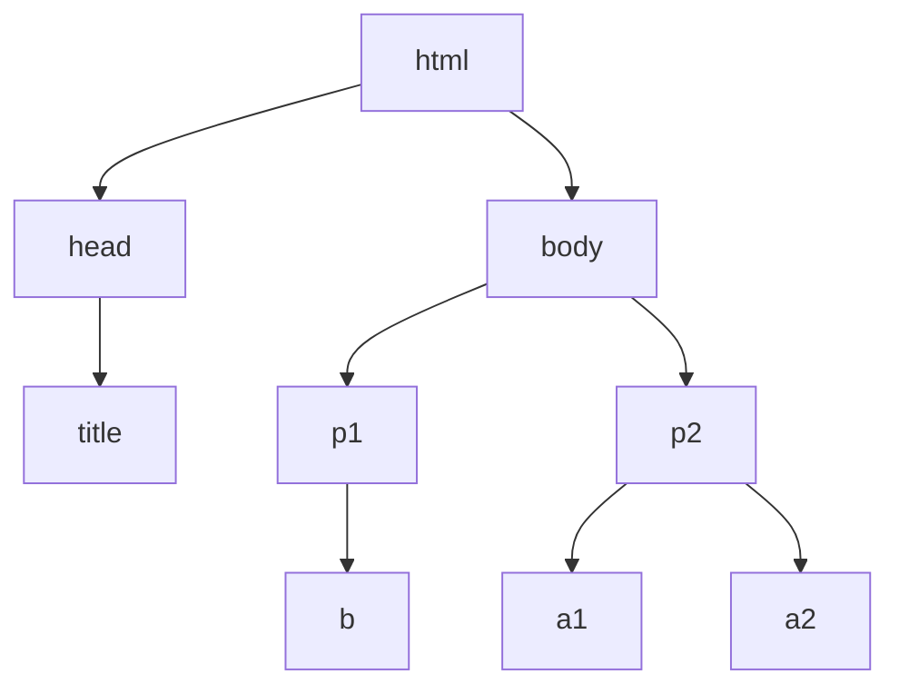

#  基于bs4库的HTML内容遍历方法

回顾demo.html:

```python
>>> import requests
>>> r = requests.get("http://python123.io/ws/demo.html")
>>> r.text      
>>> demo = r.text
>>> demo
'<html><head><title>This is a python demo page</title></head>\r\n<body>\r\n<p class="title"><b>The demo python introduces several python courses.</b></p>\r\n<p class="course">Python is a wonderful general-purpose programming language. You can learn Python from novice to professional by tracking the following courses:\r\n<a href="http://www.icourse163.org/course/BIT-268001" class="py1" id="link1">Basic Python</a> and <a href="http://www.icourse163.org/course/BIT-1001870001" class="py2" id="link2">Advanced Python</a>.</p>\r\n</body></html>'
```

做结构化设计：

```html
<html>
    <head>
        <title>This is a python demo page</title>
    </head>
	<body>
		<p class="title">
    		<b>The demo python introduces several python courses.</b>
    	</p>
    	<p class="course">Python is a wonderful general-purpose programming language. You can learn Python from novice to professional by tracking the following courses:
			<a class="py1" href="http://www.icourse163.org/course/BIT-268001" id="link1">Basic Python</a> and 
    		<a class="py2" href="http://www.icourse163.org/course/BIT-1001870001" id="link2">Advanced Python</a>.
    	</p>
	</body>
</html>
```

标签标明了信息的逻辑关系。

用树状图表示：



三种遍历方法：

+ 下行遍历（从根节点向叶子节点）

+ 上行遍历（从叶子节点向根节点）

+ 平行遍历（在平级节点直接遍历）

****


## 下行遍历方法：

| 属性         | 说明                                                    |
| ------------ | ------------------------------------------------------- |
| .contents    | 子节点的列表，将tag所有儿子节点存入列表                 |
| .children    | 子节点的迭代类型，与.contents类似，用于循环遍历儿子节点 |
| .descendants | 子孙节点的迭代类型，包含所有子孙节点，用于循环遍历      |

### 例子：

```python
>>> soup = BeautifulSoup(demo, "html.parser")
>>> soup.head
<head><title>This is a python demo page</title></head>
>>> soup.head.contents
[<title>This is a python demo page</title>]
```

head标签的儿子节点是title标签，title标签被放到了一个列表中。

body标签的儿子节点：

```python
>>> soup.body.contents
['\n', <p class="title"><b>The demo python introduces several python courses.</b></p>, '\n', <p class="course">Python is a wonderful general-purpose programming language. You can learn Python from novice to professional by tracking the following courses:

<a class="py1" href="http://www.icourse163.org/course/BIT-268001" id="link1">Basic Python</a> and <a class="py2" href="http://www.icourse163.org/course/BIT-1001870001" id="link2">Advanced Python</a>.</p>, '\n']
>>> len(soup.body.contents)
5
>>> soup.body.contents[1]
<p class="title"><b>The demo python introduces several python courses.</b></p>
```

对于一个标签的儿子节点，不止包括，标签节点，也包括字符串节点。比如'\n'回车，也是一个body标签的儿子节点类型.

用**len()**获得儿子节点的数量，有5个。

查看第二个节点信息，输出了p标签的节点信息。

+ 遍历儿子节点：

```python
for child in soup.body.children:
    print(child)
```

+ 遍历子孙节点：

```python
for child in soup.body.descendants:
    print(child)
```

****


## 标签树的上行遍历：

| 属性     | 说明                                         |
| -------- | -------------------------------------------- |
| .parent  | 节点的父亲标签                               |
| .parents | 节点先辈标签的迭代类型，用于循环遍历先辈节点 |

### 例子：

```python
>>> soup = BeautifulSoup(demo, "html.parser")
>>> soup.title.parent
<head><title>This is a python demo page</title></head>
>>> soup.html.parent
<html><head><title>This is a python demo page</title></head>
<body>
<p class="title"><b>The demo python introduces several python courses.</b></p>
<p class="course">Python is a wonderful general-purpose programming language. You can learn Python from novice to professional by tracking the following courses:

<a class="py1" href="http://www.icourse163.org/course/BIT-268001" id="link1">Basic Python</a> and <a class="py2" href="http://www.icourse163.org/course/BIT-1001870001" id="link2">Advanced Python</a>.</p>
</body></html>
>>> soup.parent

```

title的父亲标签是head标签。

html的父亲标签是它自己，因为它是最高一级标签

soup的父亲标签没有输出结果，soup的父亲是空的

### 代码：

```python
>>> soup = BeautifulSoup(demo, "html.parser")
>>> for parent in soup.a.parents:
		if parent is None:
			print(parent)
		else:
			print(parent.name)
p
body
html
[document]
```

在遍历所有先辈标签的时候，会遍历到soup本身，由于soup没有父亲节点，所以如果遍历到None就不打印名字。

****


## 标签树的平行遍历

| 属性               | 说明                                                 |
| ------------------ | ---------------------------------------------------- |
| .next_sibling      | 返回按照HTML文本顺序的下一个平行节点标签             |
| .previous_sibling  | 返回按照HTML文本顺序的上一个平行节点标签             |
| .next_siblings     | 迭代类型，返回按照HTML文本顺序的后续所有平行节点标签 |
| .previous_siblings | 迭代类型，返回按照HTML文本顺序的前续所有平行节点标签 |

平行节点遍历的条件：

+ **平行遍历必须发生在同一个父亲节点下的各节点之间**

如果不是同一个父亲节点下的标签之间并不构成平行遍历关系

 ### 例子：

```python
>>> soup = BeautifulSoup(demo, "html.parser")
>>> soup.a.next_sibling
' and '
```

通过.next_sibling发现a标签的下一个平行节点是一个字符串'and'。

在标签树中，尽管树形结构采用的是标签的形式来组织，但是标签之间的NavigableString也构成了标签树的节点，也就是说，任何一个节点的平行标签和儿子标签是可能存在NavigableString类型的。所有不能认为，平行遍历的下一个节点一定是标签类型，而是需要做相关的判断。

```python
>>> soup.a.next_sibling.next_sibling
<a class="py2" href="http://www.icourse163.org/course/BIT-1001870001" id="link2">Advanced Python</a>
```

我们看到a标签的下一个标签的下一个标签是另外一个a标签

```python
>>> soup.a.previous_sibling
'Python is a wonderful general-purpose programming language. You can learn Python from novice to professional by tracking the following courses:\r\n'
>>> soup.a.previous_sibling.previous_sibling

```

a标签的前一个平行标签是一段文本，再之前的标签是空信息

```python
>>> soup.a.parent
<p class="course">Python is a wonderful general-purpose programming language. You can learn Python from novice to professional by tracking the following courses:

<a class="py1" href="http://www.icourse163.org/course/BIT-268001" id="link1">Basic Python</a> and <a class="py2" href="http://www.icourse163.org/course/BIT-1001870001" id="link2">Advanced Python</a>.</p>
```

这里可以看到a标签的父亲标签是p标签。

+ 遍历后续标签：

  ```python
  for sibling in soup.a.next_siblings:
      print(sibling)
  ```

+ 遍历前续标签：

  ```python
  for sibling in soup.a.previous_siblings:
      print(sibling)
  ```

